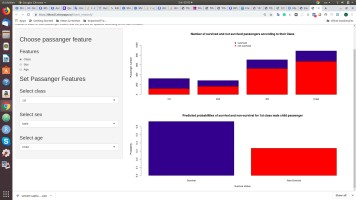
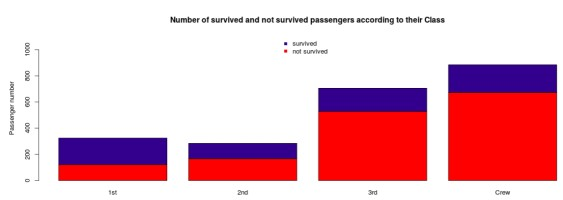
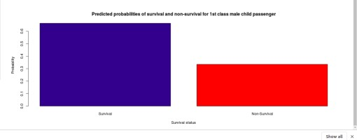

Titanic Pitch
========================================================
author: Daniel Krasner
date: 28/06/2019
autosize: true

This presentation refers to [Titanic Research Application](https://dkras55.shinyapps.io/titanic_research/)

This presentation contains evaluated R code, please see the source file in [GitHub repositary](https://github.com/kras55/titanic_pitch)
Motivation
========================================================

Titanic sinking was one of the most famous shipwreck in history.
More than 1500 people were dead and it is still hard to understand the reasons of this extraordinary large victim number. We can use Titanic dataset from R datasets to explore the passenger features, associated with high or low fatality result. 
There are 2201 observations of the following 4 variables available in the Titanic dataset:

- Class
- Sex
- Age
- Survived

Application helps to explore the association between  3 passenger features and Survived output.

Application Structure
========================================================

The application consists of the control vidgets panel and main panel.
Control vidgets enable user to perform user inputs and plots on main panel dynamically respond to these inputs. The plot data are automatically updated according to user inputs and this interactive communication helps to understand more clearly the data and the research output.

Association between passenger features and survival result.
========================================================

An application user can explore the assosiation between given passenger features and his/her survival result. User can interactively input one of available features and application in response will rebuild the plot in order to display the data wich are relevant to user input.
Thus it becomes more obvious which features and how could influence passenger survival.

Association between passenger features and survival result.
========================================================

An application user can also predict the probability of survival and non-survival for a passenger with certain feature values. The user inputs the feature values and application calculetes the output for this values and immediately displays it as a barplot. 
Thus it becomes more obvious what probability of survival is associated with every kind of passenger.

